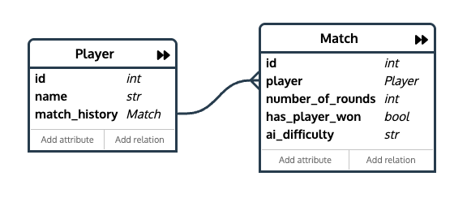

# Battleship Game

A web-based Battleship game built with Python and NiceGUI. Players create a profile, place ships on a board, and take turns shooting at an AI opponent. The AI supports multiple difficulty levels, including an optional LLM-based strategy via Ollama.

---

## ⚙️ Technology Stack

- **Language:** Python 3.10+
- **Web Framework:** NiceGUI
- **Database:** SQLite + SQLModel (ORM)
- **Testing:** pytest
- **AI:** Algorithmic strategies + LLM-based AI (via Ollama, optional)

---

## 🚀 Getting Started

### Prerequisites

- Python 3.10+

### Setup

1. Create a virtual environment:

   ```bash
   python3 -m venv .venv
   ```

2. Activate it:

   ```bash
   source .venv/bin/activate
   ```

3. Install dependencies:

   ```bash
   pip install -r requirements.txt
   ```

### Run

```bash
python start.py
```

The app opens in your browser at `http://localhost:8080`.

---

## 📂 Repository Structure

```text
start.py

src/
├── ai/
│   ├── ai.py
│   ├── algorithmic_ai.py
│   ├── difficulty.py
│   └── llm_ai.py
├── assets/
│   └── menu-background.png
├── database/
│   ├── db.py
│   ├── player.py
│   └── match.py
├── core/
│   ├── board.py
│   ├── game.py
│   ├── player.py
│   └── ships.py
├── ui/
│   ├── app.py
│   ├── constants.py
│   ├── styles.py
│   └── pages/
│       ├── player_selector_page.py
│       ├── main_menu_page.py
│       ├── stats_page.py
│       ├── help_page.py
│       ├── game_page.py
│       └── helpers/
│           ├── access_control.py
│           ├── navigation.py
│           ├── player_selection.py
│           └── storage_session.py
└── utils/
    ├── app_types.py
    ├── constants.py
    └── helpers.py

tests/
├── ai/
│   ├── algorithmic_ai_test.py
│   └── difficulty_test.py
├── core/
│   ├── board_test.py
│   ├── game_test.py
│   └── ships_test.py
├── database/
│   ├── match_test.py
│   └── player_test.py
├── conftest.py
└── helpers.py
```

---

## 📝 Design

### User Stories

#### 1. Start a Game

**As a user, I want to start a new Battleship match from the main menu.**

- **Inputs:** menu selection
- **Outputs:** active game session

#### 2. Place Ships

**As a user, I want to place my ships on the board.**

- **Inputs:** start coordinate, end coordinate
- **Outputs:** ships placed on the player board

#### 3. Play Against AI

**As a user, I want to play against an AI opponent with different difficulty levels.**

- **Inputs:** selected difficulty
- **Outputs:** AI moves based on the selected strategy

#### 4. Shoot at Enemy Board

**As a user, I want to select a coordinate to shoot at the enemy board.**

- **Inputs:** coordinate (`row`, `column`)
- **Outputs:** hit or miss result, updated board state

#### 5. View Stats

**As a user, I want to view my match history and statistics.**

- **Inputs:** player profile selection
- **Outputs:** win/loss record and match history

### Use Cases

**Actors:** Player, AI Opponent

**Main use cases:** Start Game · Place Ships · Shoot at Enemy Board · Use AI Opponent · View Stats

### Wireframes


### Database Diagram



---

## ✅ Project Requirements

Each app must meet the following criteria (see also the official project guidelines PDF on Moodle):

1. Interactive application flow
2. Data validation
3. Clear separation of game logic and state handling

### 1. Interactive App

The app runs in a web browser. Users can:

- navigate the main menu
- create or select a player profile
- place ships on the board
- shoot at enemy coordinates
- see board updates after each turn

### 2. Data Validation

User input is validated before use:

- ship placement is checked against board boundaries and overlap
- repeated shots are rejected

### 3. Game State Management

Game state is managed in the core classes:

- `Board` stores ship and shot state
- `Player` combines board and ships
- `AI` controls enemy shot selection and ship placement
- Database layer (`Player` + `Match` models) persists profile and game results

---

## 🧪 Testing

The test suite covers:

- unit tests for board and ship logic
- AI strategy tests for shot selection and difficulty ranking
- integration tests for game flow and persistence
- database tests for player and match records

Run tests with:

```bash
pytest -s
```

The `-s` flag disables output capture, printing each test result in this format:

```text
| ID     | Status | Expected | Actual | Comments |
```

### Test Cases

#### AI Strategy ([tests/ai/algorithmic_ai_test.py](tests/ai/algorithmic_ai_test.py))

| ID     | Title                                                         |
| ------ | ------------------------------------------------------------- |
| TC_001 | Impossible AI selects an unshot ship cell when one exists     |
| TC_002 | Hard AI extends a horizontal hit group                        |
| TC_003 | Normal AI never returns an already-shot coordinate            |
| TC_004 | Reset clears tracked shots and strategy                       |
| TC_005 | Unsunk hit detection returns only valid shot ship coordinates |

#### AI Difficulty ([tests/ai/difficulty_test.py](tests/ai/difficulty_test.py))

| ID     | Title                                           |
| ------ | ----------------------------------------------- |
| TC_006 | Invalid difficulty falls back to default        |
| TC_007 | Available difficulties match enum               |
| TC_008 | Difficulty ranks span 1 to 10                   |
| TC_009 | Difficulty summary format (e.g., "Hard (8/10)") |

#### Database — Players ([tests/database/player_test.py](tests/database/player_test.py))

| ID     | Title                                                 |
| ------ | ----------------------------------------------------- |
| TC_010 | create_player persists and is retrievable by name     |
| TC_019 | get_all_players returns players in alphabetical order |
| TC_020 | register_player with duplicate name returns failure   |

#### Database — Matches ([tests/database/match_test.py](tests/database/match_test.py))

| ID     | Title                                                       |
| ------ | ----------------------------------------------------------- |
| TC_011 | create_match persists and links to correct player           |
| TC_012 | get_matches_by_player_id returns empty list when no matches |

#### Core — Game ([tests/core/game_test.py](tests/core/game_test.py))

| ID     | Title                                                        |
| ------ | ------------------------------------------------------------ |
| TC_013 | Player win is persisted correctly with has_player_won=True   |
| TC_014 | Player loss is persisted correctly with has_player_won=False |
| TC_015 | Two games produce two distinct match records                 |
| TC_021 | number_of_rounds increments after full round                 |
| TC_022 | is_game_over is true after all player ships removed          |

#### Core — Ships ([tests/core/ships_test.py](tests/core/ships_test.py))

| ID     | Title                                               |
| ------ | --------------------------------------------------- |
| TC_016 | has_ships is false after last ship removed          |
| TC_017 | decrease_ship removes ship when last coordinate hit |

#### Core — Board ([tests/core/board_test.py](tests/core/board_test.py))

| ID     | Title                                                         |
| ------ | ------------------------------------------------------------- |
| TC_018 | shoot_ship returns ship name on hit, None on miss, marks cell |

### Test Case Template

Each test case follows this structure:

1. **Test case ID** – unique identifier (TC_XXX)
2. **Title** – concise description of what is tested
3. **Preconditions** – required setup state
4. **Steps** – ordered actions performed during test
5. **Test data/input** – input values used
6. **Expected result** – the successful outcome
7. **Actual result** – outcome from execution (populated when the test runs)
8. **Status** – pass or fail
9. **Comments** – additional notes

---

## 🤝 Contributing

### Syncing dependencies

If a teammate has updated `requirements.txt`, re-run:

```bash
pip install -r requirements.txt
```

### Adding a new package

1. Install the package: `pip install <package-name>`
2. Save it to the lockfile: `pip freeze > requirements.txt`
3. Commit the updated `requirements.txt`.

---

## 👥 Team

| Name    | Contribution             |
| ------- | ------------------------ |
| Niels   | Smart AI LLM + Algorithm |
| Alex    | DB + NiceGUI integration |
| Héloïse | UI implementation        |

---

## 📄 License

This project is provided for educational use only as part of the Advanced Programming module.

[MIT License](LICENSE)
