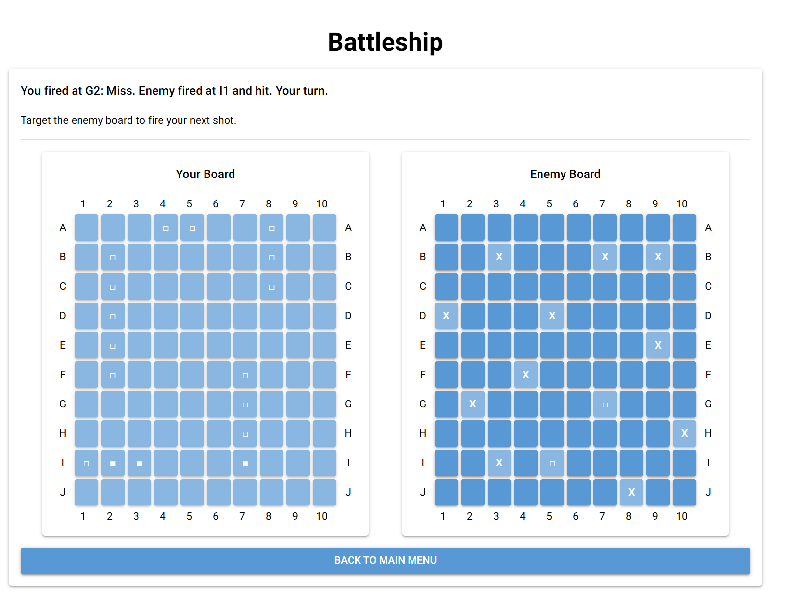
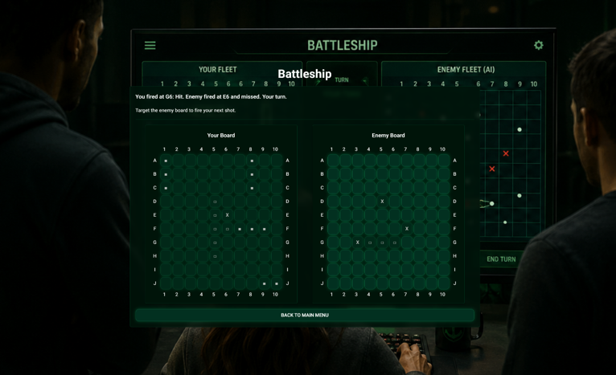
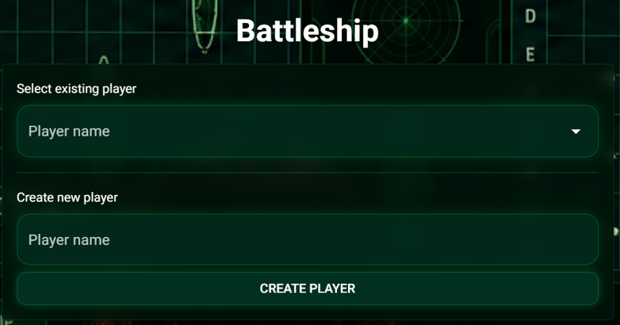
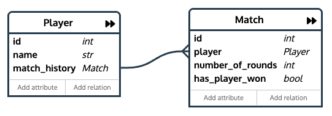

# Battleship Game

A web-based Battleship game built with Python and NiceGUI.

## Requirements

- Python 3.10+ (for type hints and `match` statements).
- Dependencies listed in `requirements.txt`.

## Environment setup

Prepare the project with a virtual environment and install dependencies:

1. Create the virtual environment:

   ```bash
   python3 -m venv .venv
   ```

   This creates an isolated Python environment in the `.venv` folder.

2. Activate the virtual environment:

   ```bash
   source .venv/bin/activate
   ```

   This switches your current terminal to use the `.venv` Python and pip.

3. Install packages from requirements.txt:
   ```bash
   pip install -r requirements.txt
   ```
   This installs all required dependencies into the active virtual environment.

## Updating local dependencies

If a package has been added/updated and updated `requirements.txt`, you only need to sync your local environment:

1. Activate the virtual environment:

   ```bash
   source .venv/bin/activate
   ```

2. Install/update dependencies from `requirements.txt`:
   ```bash
   pip install -r requirements.txt
   ```
   This installs any missing packages and updates versions to match the project file.

## Adding a new package (contributors)

Only use this when you are the one introducing a new dependency:

1. Activate the virtual environment:

   ```bash
   source .venv/bin/activate
   ```

2. Install the package:

   ```bash
   pip install <package-name>
   ```

3. Save the updated environment to `requirements.txt`:
   ```bash
   pip freeze > requirements.txt
   ```

## Deactivating the environment

When you stop working on the project, you can deactivate the environment with:

```bash
deactivate
```

This returns your terminal to the system Python environment.

(You do not have to deactivate if you are just closing that terminal window, but deactivating is recommended when you want to continue using the same terminal for other projects.)

## How to run

From the project root:

```bash
python start.py
```

---

This project is a web-based Battleship game built with Python and NiceGUI.

It aims to:

- provide a playable Battleship game against AI
- demonstrate clean separation between UI, game logic, and helper utilities
- support multiple AI difficulty levels
- keep the code testable and maintainable

---

## 📝 Application Requirements

### Problem

Battleship is a turn-based strategy game where players must place ships, guess enemy ship positions, and avoid repeating shots.

---

### Scenario

The application allows users to:

- place ships on a board
- shoot at enemy coordinates
- play against AI opponents with different difficulty levels
- track wins/losses via the stats system

---

## 📖 User Stories

### 1. Start a Game

**As a user, I want to start a new Battleship match from the main menu.**

- **Inputs:** menu selection
- **Outputs:** active game session

---

### 2. Place Ships

**As a user, I want to place my ships on the board.**

- **Inputs:** start coordinate, end coordinate
- **Outputs:** placed ships on the player board

---

### 3. Shoot at Enemy Board

**As a user, I want to enter a coordinate to shoot at the enemy board.**

- **Inputs:** coordinate (`row`, `column`)
- **Outputs:** hit or miss result, updated board state

---

### 4. Play Against AI

**As a user, I want to play against an AI opponent with different difficulty levels.**

- **Inputs:** selected difficulty
- **Outputs:** AI moves based on the selected strategy

---

### 5. View and Save Stats

**As a user, I want to view and save my statistics.**

- **Inputs:** username, stats menu selection
- **Outputs:** stored stats, saved/loaded profile

---

## 🧩 Use Cases

### Main Use Cases

- Start Game
- Place Ships
- Shoot at Enemy Board
- Use AI Opponent
- View Stats

### Actors

- Player
- AI Opponent

---

### Wireframes / Mockups





---

## 🗄️ Database and ORM




---

## ✅ Project Requirements

---

Each app must meet the following criteria in order to be accepted (see also the official project guidelines PDF on Moodle):

1. Interactive application flow
2. Data validation in the app
3. Clear separation of game logic and state handling

---

### 1. Interactive App

The application interacts with the user via the terminal. Users can:

- navigate the main menu
- create or load stats
- place ships
- shoot at coordinates
- observe board updates after each turn

---

### 2. Data Validation

The application validates user input to ensure correct coordinates and legal ship placement.

- coordinate format is checked before use
- ship placement is checked against board boundaries and overlap
- repeated shots are prevented

---

### 3. Game State Management

Game state is managed in the core classes:

- `Board` stores ship and shot state
- `Player` combines board and ships
- `AI` controls enemy shot selection and ship placement
- `Stats` stores profile and game results

---

## ⚙️ Implementation

### Technology Stack

- **Language:** Python 3.10+
- **Web Framework:** NiceGUI
- **Database:** SQLite + SQLModel (ORM)
- **Testing:** pytest
- **AI:** Algorithmic strategies + LLM-based AI (via Ollama)

### Core Libraries

- **NiceGUI** – web-based UI and routing
- **SQLModel** – database models and ORM
- **SQLAlchemy** – database session and query management
- **pytest** – unit and integration testing
- **Ollama** (optional) – local LLM support for advanced AI opponent

---

## 📂 Repository Structure

```text
start.py
test.py

src/
├── app_types.py
├── ai/
│   ├── ai.py
│   ├── algorithmic_ai.py
│   └── llm_ai.py
├── assets/
│   └── menu-background.png
├── database/
│   ├── db.py
│   ├── player.py
│   └── match.py
├── config/
│   ├── config.py
│   └── config.json
├── core/
│   ├── board.py
│   ├── game.py
│   ├── player.py
│   └── ships.py
├── ui/
│   ├── app.py
│   ├── constants.py
│   ├── styles.py
│   └── pages/
│       ├── player_selector_page.py
│       ├── main_menu_page.py
│       ├── stats_page.py
│       ├── help_page.py
│       ├── game_page.py
│       └── helpers/
│           ├── access_control.py
│           ├── navigation.py
│           ├── player_selection.py
│           └── storage_session.py
└── utils/
    └── helpers.py

tests/
├── ai/
│   ├── algorithmic_ai_test.py
│   └── difficulty_test.py
├── core/
│   ├── board_test.py
│   ├── game_test.py
│   └── ships_test.py
├── database/
│   ├── match_test.py
│   ├── player_test.py
├── conftest.py
└── helpers.py
```

---

## 🧪 Testing

**Test mix:**

- Unit tests for board and ship handling
- AI strategy tests for shot selection and difficulty ranking
- Integration tests for game flow and persistence
- Database persistence tests for player and match data

Run tests with:

```bash
pytest
```

### Automated Test Cases

#### AI Strategy Tests ([tests/ai/algorithmic_ai_test.py](tests/ai/algorithmic_ai_test.py))

| ID     | Title                                                         |
| ------ | ------------------------------------------------------------- |
| TC_001 | Impossible AI selects an unshot ship cell when one exists     |
| TC_002 | Hard AI extends a horizontal hit group                        |
| TC_003 | Normal AI never returns an already-shot coordinate            |
| TC_004 | Reset clears tracked shots and strategy                       |
| TC_005 | Unsunk hit detection returns only valid shot ship coordinates |

#### AI Difficulty Tests ([tests/ai/difficulty_test.py](tests/ai/difficulty_test.py))

| ID     | Title                                                  |
| ------ | ------------------------------------------------------ |
| TC_006 | Invalid difficulty falls back to default               |
| TC_007 | Available difficulties match enum                      |
| TC_008 | Difficulty ranks span 1 to 10                          |
| TC_009 | Difficulty summary format (e.g., "Hard (8/10)")        |

#### Database Player Tests ([tests/database/player_test.py](tests/database/player_test.py))

| ID     | Title                                                       |
| ------ | ----------------------------------------------------------- |
| TC_010 | create_player persists and is retrievable by name           |
| TC_019 | get_all_players returns players in alphabetical order       |
| TC_020 | register_player with duplicate name returns failure         |

#### Database Match Tests ([tests/database/match_test.py](tests/database/match_test.py))

| ID     | Title                                                        |
| ------ | ------------------------------------------------------------ |
| TC_011 | create_match persists and links to correct player            |
| TC_012 | get_matches_by_player_id returns empty list when no matches  |

#### Core Game Tests ([tests/core/game_test.py](tests/core/game_test.py))

| ID     | Title                                                        |
| ------ | ------------------------------------------------------------ |
| TC_013 | Player win is persisted correctly with has_player_won=True   |
| TC_014 | Player loss is persisted correctly with has_player_won=False |
| TC_015 | Two games produce two distinct match records                 |
| TC_021 | number_of_rounds increments after full round                 |
| TC_022 | is_game_over is true after all player ships removed          |

#### Core Ship Tests ([tests/core/ships_test.py](tests/core/ships_test.py))

| ID     | Title                                                     |
| ------ | --------------------------------------------------------- |
| TC_016 | has_ships is false after last ship removed                |
| TC_017 | decrease_ship removes ship when last coordinate hit       |

#### Core Board Tests ([tests/core/board_test.py](tests/core/board_test.py))

| ID     | Title                                                            |
| ------ | ---------------------------------------------------------------- |
| TC_018 | shoot_ship returns ship name on hit, None on miss, marks cell    |

### Test Case Template

Each test case follows this structure:

1. **Test case ID** – unique identifier (TC_XXX)
2. **Title** – concise description of what is tested
3. **Preconditions** – required setup state
4. **Steps** – ordered actions performed during test
5. **Test data/input** – input values used
6. **Expected result** – successful outcome
7. **Actual result** – outcome from execution (populated when test runs)
8. **Status** – pass or fail
9. **Comments** – additional notes
9. Comments – additional notes

---

## 👥 Team & Contributions

| Name      | Contribution                       |
| --------- | ---------------------------------- |
| Niels     | Smart AI LLM + Algorithmic         |
| Alex      | DB + overwork UI                   |
| Héloïse   | New UI implementation              |

---

## 🤝 Contributing

> 🚧 This is a template repository for student projects.  
> 🚧 Do not change this section in your final submission.

- Use this repository as a starting point by importing it into your own GitHub account
- Work only within your own copy — do not push to the original template
- Commit regularly to track your progress

---

## 📝 License

This project is provided for educational use only as part of the Advanced Programming module.

[MIT License](LICENSE)
